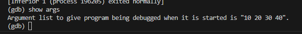
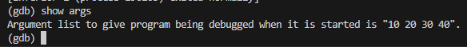
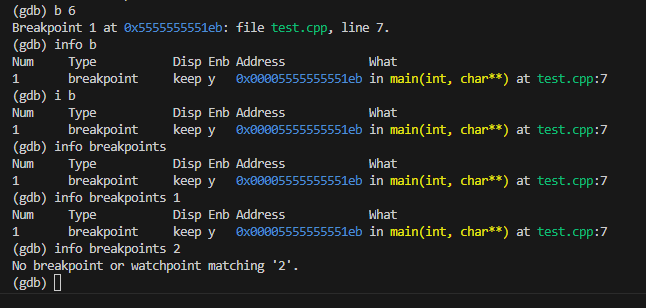
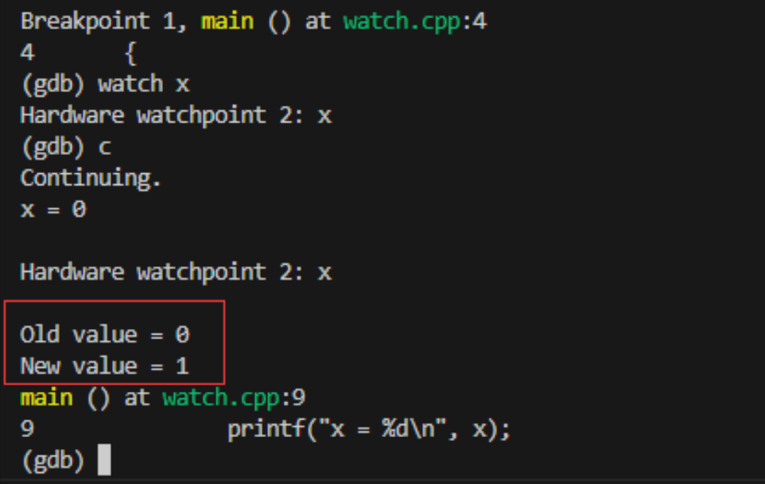
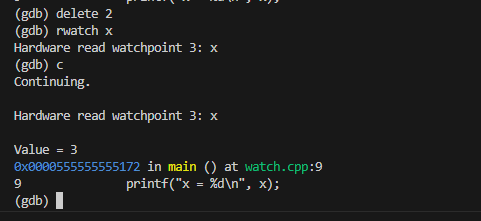
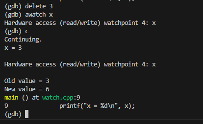
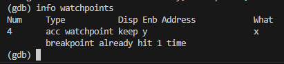
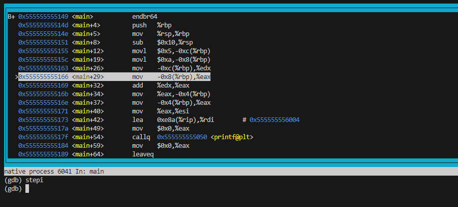

## 相关参考链接
- https://wizardforcel.gitbooks.io/100-gdb-tips/content/set-step-mode-on.html
- https://wizardforcel.gitbooks.io/100-gdb-tips/content/set-step-mode-on.html

## 设置程序运行参数
- 命令`set args 10 20 30 40`



- 使用`show args`显示设置好的运行参数



## `path` 命令用于设置或显示当前的搜索路径列表。这些路径用于查找可执行文件、源文件和符号文件等。在调试过程中，GDB 会按照指定的路径顺序搜索这些文件。
- `show path`或者`show paths`查看搜索路径
## `set environment varname [=value]`命令用于设置或修改调试过程中使用的环境变量。此命令允许你在调试程序时指定特定的环境变量值，这些值会影响被调试程序的行为。
- 例如`set environment PATH = /usr/local/bin:/usr/bin:/bin`修改PATH的值。
## `unset environment`取消环境变量
- `unset environment LD_LIBRARY_PATH`
## `show environment`显示当前环境变量
## 工作目录
- `cd dir` 进入指定目录
- `pwd` 显示当前所在目录
## 程序的输入输出
- `info terminal` 显示程序用到的终端的模式
- 使用重定向控制程序输出 `run > outfile`
- `tty` 命令用于指定被调试程序的输入和输出终端，将被调试程序的输入和输出重定向到一个特定的终端设备，从而与 GDB 的输入和输出分开。假设你有一个终端设备 /dev/pts/2，你希望被调试的程序使用这个终端设备进行输入和输出：`(gdb) tty /dev/pts/2`
## 暂停恢复程序运行
- 在GDB中，有以下几种方式暂停：断点、观察点、捕捉点、信号、线程停止，如果要恢复程序运行，使用`c`或者`continue`命令。
## 设置断点
- `break function`,在进入指定函数时停住，C++中可以使用class::function或者function(type, type)格式指定函数名。
- `break line`指定行号停住。
- `break +offset`、`break -offset`在在当前执行位置之后或者之前的几条指令处设置一个断点。
- `break filename:linenum`在源文件filename的linenum处停住。
- `break filename:function`在源文件filename的Function函数的入口处停住。
- `break *address`在程序运行的内存地址处停住。
- `break`没有参数表示在下一条指令处停住。
- `break ... if condition`在满足条件时停住，比如循环过程中，`break if i == 100`表示i为100时停住。
## 查看断点
- `i[nfo] b[reakpoints] [n]`查看断点信息，中括号表示可以不写，n表示断点号，不写表示查看所有断点。



## 设置观察点
- 观察点一般用来观察某个表达式（变量也是一种表达式）的值是否有变化了，如果有变化，则马上停住。
- `watch expr`为表达式expr设置一个观察点，一旦表达式有变化时，立马停住程序。
- `rwatch expr`当表达式变量expr被读取时，停住程序。
- `awatch expr`当表达式（变量）的值被读或者被写时，停住程序。
- `info watchpoints`列出所有设置了的观察点。
- 使用测试程序`watch.cpp`，编译命令`g++ -g -o watch watch.cpp`



- 先删除watch断点2，添加rwatch断点，当变量x第一次被读取时，程序暂停执行并进入GDB



- 先删除rwatch断点，添加awatch断点，当变量x第一次被读取或写入时，程序暂停执行并进入GDB。



- 查看观察点信息。



## 设置捕捉点
- 设置捕捉点来捕捉程序运行时的一些事件，如载入共享库、C++异常。
```bash
$gcc -g  catch.c -o catch
#gcc -g  child.c -o child
$ gdb catch
GNU gdb (Ubuntu 9.2-0ubuntu1~20.04) 9.2
Copyright (C) 2020 Free Software Foundation, Inc.
License GPLv3+: GNU GPL version 3 or later <http://gnu.org/licenses/gpl.html>
This is free software: you are free to change and redistribute it.
There is NO WARRANTY, to the extent permitted by law.
Type "show copying" and "show warranty" for details.
This GDB was configured as "x86_64-linux-gnu".
Type "show configuration" for configuration details.
For bug reporting instructions, please see:
<http://www.gnu.org/software/gdb/bugs/>.
Find the GDB manual and other documentation resources online at:
    <http://www.gnu.org/software/gdb/documentation/>.

For help, type "help".
Type "apropos word" to search for commands related to "word"...
Reading symbols from catch...
(gdb) set follow-fork-mode child
(gdb) catch exec
Catchpoint 1 (exec)
(gdb) r
Starting program: /home/aaa/bbb/ccc/GDBDebug/test1/catch 
[Attaching after process 1409038 fork to child process 1409042]
[New inferior 2 (process 1409042)]
[Detaching after fork from parent process 1409038]
[Inferior 1 (process 1409038) detached]
process 1409042 is executing new program: /home/aaa/bbb/ccc/GDBDebug/test1/child
[Switching to process 1409042]

Thread 2.1 "child" hit Catchpoint 1 (exec'd /home/aaa/bbb/ccc/GDBDebug/test1/child), 0x00007ffff7fd0100 in _start () from /lib64/ld-linux-x86-64.so.2
(gdb) b main
Breakpoint 2 at 0x555555555149: file child.c, line 7.
(gdb) l
1       #include <stdlib.h>
2       #include <stdio.h>
3       #include <unistd.h>
4
5       int my_print();
6       int main()
7       {
8           my_print();
9           return 0;
10      }
(gdb) b my_print 
Breakpoint 3 at 0x555555555162: file child.c, line 13.
(gdb) c
Continuing.

Thread 2.1 "child" hit Breakpoint 2, main () at child.c:7
7       {
(gdb) l
2       #include <stdio.h>
3       #include <unistd.h>
4
5       int my_print();
6       int main()
7       {
8           my_print();
9           return 0;
10      }
11
(gdb) s
8           my_print();
(gdb) n

Thread 2.1 "child" hit Breakpoint 3, my_print () at child.c:13
13      {
(gdb) n
14          printf("hello world\n");
(gdb) n
hello world
15          return 0;
(gdb) n
16      }
(gdb) 
main () at child.c:9
9           return 0;
(gdb) 
10      }
(gdb) 
__libc_start_main (main=0x555555555149 <main>, argc=1, argv=0x7fffffffdd48, init=<optimized out>, fini=<optimized out>, rtld_fini=<optimized out>, stack_end=0x7fffffffdd38) at ../csu/libc-start.c:342
342     ../csu/libc-start.c: No such file or directory.
(gdb) 
[Inferior 2 (process 1409042) exited normally]
```
- 上面的例子中，最重要的操作时catch exec这个事件。捕获到exec这个事件之后再往子进程的程序中打一个断点，然后执行continue操作。可以看到，此时程序就会进入到exec调用的子进程中了。

相关参考：
https://blog.csdn.net/www_dong/article/details/117304481

- `catch throw`捕获C++抛出的异常
- `catch exec`捕获系统调用exec时
- `catch fork`捕获系统调用fork
- `catch vfork`系统调用vfork时
- `catch load`载入共享库时
- `catch unload`卸载共享库时
- `tcatch <event>`值设置一次捕捉点，当程序停住以后，应当自动删除

## 维护停止点

上面设置了停止点，如果需要取消停止点，可以使用`delete`，`clear`，`disable`，`enable`这几个命令来进行维护
- `clear`清除所有已经定义的停止点
- `clear <function>`和`clear <filename:function>`清除指定函数上的停止点
- `clear <linenum>`和`clear <filename:linenum>`清除指定行上的停止点
- `delete [breakpoints] [range...]`删除指定的断点，如果不指定断点，则表示删除所有的断点，range表示删除断点的范围，例如1-4
- `disable [breakpoints] [range...]`disable所指定的停止点，breakpoints为停止点，如果不指定，表示disable所有的停止点，简写dis
- `enable [breakpoints] [rangs...]`enable表示启动指定的停止点
- `enable [breakpoints] once range...`enable指定的停止点一次，当程序停止后，该停止点自动disable
- `enable [breakpoints] delete ragne...`enable所指定的停止点一次，当程序停止后，自动删除

## 停止条件维护

只有break和watch命令支持设置条件断点。
- `condition <bnum> <expression>`修改断点号为bnum的停止条件为expression
- `condition <bnum>`清除断点号为bnum的停止条件
- `ignore <bnum> <count>`程序运行时，忽略某个断点count次

## 为断点设定运行命令

在断点停住时，可以让其运行一些别的命令。
- `command [bnum] ... command-list... end`为断点指定一个命令列表，当程序在断点停住时，命令列表里面的命令依次被运行

使用如下程序代码进行测试：
```C++
// command.cpp
#include <iostream>

void foo(int x)
{
    std::cout << "x = " << x << std::endl;
}

int main()
{
    for (int i = 0; i < 5; ++i)
    {
        foo(i);
    }
    return 0;
}

```

假设在调试希望每次调用`foo`函数时，都打印变量`x`的值，然后继续执行程序。
编译```g++ command.cpp -o command -g```，调试过程如下：
```bash
gdb command
GNU gdb (Ubuntu 9.2-0ubuntu1~20.04) 9.2
Copyright (C) 2020 Free Software Foundation, Inc.
License GPLv3+: GNU GPL version 3 or later <http://gnu.org/licenses/gpl.html>
This is free software: you are free to change and redistribute it.
There is NO WARRANTY, to the extent permitted by law.
Type "show copying" and "show warranty" for details.
This GDB was configured as "x86_64-linux-gnu".
Type "show configuration" for configuration details.
For bug reporting instructions, please see:
<http://www.gnu.org/software/gdb/bugs/>.
Find the GDB manual and other documentation resources online at:
    <http://www.gnu.org/software/gdb/documentation/>.

For help, type "help".
Type "apropos word" to search for commands related to "word"...
Reading symbols from command...
(gdb) b foo(int) 
Breakpoint 1 at 0x11c9: file command.cpp, line 4.
(gdb) command 1
Type commands for breakpoint(s) 1, one per line.
End with a line saying just "end".
>p x
>c
>end
(gdb) r
Starting program: /home/xxxx/GDBDebug/test1/command 

Breakpoint 1, foo (x=21845) at command.cpp:4
4       {
$1 = 21845
x = 0

Breakpoint 1, foo (x=0) at command.cpp:4
4       {
$2 = 0
x = 1

Breakpoint 1, foo (x=1) at command.cpp:4
4       {
$3 = 1
x = 2

Breakpoint 1, foo (x=2) at command.cpp:4
4       {
$4 = 2
x = 3

Breakpoint 1, foo (x=3) at command.cpp:4
4       {
--Type <RET> for more, q to quit, c to continue without paging--
$5 = 3
x = 4
[Inferior 1 (process 2436410) exited normally]
```

```bash
(gdb) b foo(int) if x > 0
Breakpoint 3 at 0x5555555551c9: file command.cpp, line 4.
(gdb) commands
Type commands for breakpoint(s) 3, one per line.
End with a line saying just "end".
>printf "x is %d\n", x
>c
>end
(gdb) r
Starting program: /home/xxx/GDBDebug/test1/command 

Breakpoint 3, foo (x=21845) at command.cpp:4
4       {
x is 21845
x = 0
x = 1

Breakpoint 3, foo (x=1) at command.cpp:4
4       {
x is 1
x = 2

Breakpoint 3, foo (x=2) at command.cpp:4
4       {
x is 2
x = 3

Breakpoint 3, foo (x=3) at command.cpp:4
4       {
x is 3
x = 4
[Inferior 1 (process 2441936) exited normally]
```

- 如果要清除断点上的命令，指定`commands`，然后在输出`end`即可

## 恢复程序运行和单步调试
- `continue`命令继续执行程序，直到结束或者遇到下一个断点
- `step <count>`单步执行，如果有函数则进入函数，进入函数的前提是该函数含有debug信息
- `next <count>`单步调试，不会进入函数
- `set step-mode on / off`我在做测试时，都可以进入到库函数的调用中，具体原因暂不详细，下面是例子

- 所使用的代码
```
// step_mode.c
#include <stdio.h>

void customFunction()
{
    printf("Inside customFunction\n");
}

int main()
{
    printf("Hello, World!\n");
    customFunction();
    return 0;
}
```
- 编译命令```gcc -g step_mode.c -o step_mode -o0```，执行过程如下：

```bash
(gdb) b main
Breakpoint 1 at 0x1160: file step_mode.c, line 9.
(gdb) r
Starting program: /home/aaa/bbb/ccc/GDBDebug/test1/step_mode 

Breakpoint 1, main () at step_mode.c:9
9       {
(gdb) set stemp-mode on
No symbol "stemp" in current context.
(gdb) set step-mode on
(gdb) r
Starting program: /home/aaa/bbb/ccc/GDBDebug/test1/step_mode 

Breakpoint 1, main () at step_mode.c:9
9       {
(gdb) s
10          printf("Hello, World!\n");
(gdb) s
__GI__IO_puts (str=0x55555555601a "Hello, World!") at ioputs.c:33
33      ioputs.c: No such file or directory.
(gdb) finish
Run till exit from #0  __GI__IO_puts (str=0x55555555601a "Hello, World!") at ioputs.c:33
Hello, World!
main () at step_mode.c:11
11          customFunction();
Value returned is $1 = 14
(gdb) s
customFunction () at step_mode.c:4
4       {
(gdb) 
5           printf("Inside customFunction\n");
(gdb) 
__GI__IO_puts (str=0x555555556004 "Inside customFunction") at ioputs.c:33
33      ioputs.c: No such file or directory.
(gdb) finish
Run till exit from #0  __GI__IO_puts (str=0x555555556004 "Inside customFunction") at ioputs.c:33
Inside customFunction
customFunction () at step_mode.c:6
6       }
Value returned is $2 = 22
(gdb) s
main () at step_mode.c:12
12          return 0;
(gdb) s
13      }
(gdb) 
__libc_start_main (main=0x555555555160 <main>, argc=1, argv=0x7fffffffdd18, init=<optimized out>, fini=<optimized out>, rtld_fini=<optimized out>, stack_end=0x7fffffffdd08) at ../csu/libc-start.c:342
342     ../csu/libc-start.c: No such file or directory.
(gdb) 
__GI_exit (status=0) at exit.c:138
138     exit.c: No such file or directory.
(gdb) 
139     in exit.c
(gdb) finish
warning: Function __GI_exit does not return normally.
Try to finish anyway? (y or n) y
Run till exit from #0  __GI_exit (status=0) at exit.c:139
[Inferior 1 (process 4103097) exited normally]
```
- `finish`命令用于在调试过程中立即运行到当前函数的末尾，并返回调用该函数的地方。这在调试库函数或长时间运行的函数时特别有用，可以快速退出函数并查看返回值和调用者

- 还是使用上面的`step_mode.c`代码，执行过程如下：

```bash
(gdb) b main
Breakpoint 1 at 0x1160: file step_mode.c, line 9.
(gdb) r
Starting program: /home/aaa/bbb/ccc/GDBDebug/test1/step_mode 

Breakpoint 1, main () at step_mode.c:9
9       {
(gdb) b cus
cuserid         cuserid.c       customFunction  
(gdb) b customFunction   ## customFunction 处断点
Breakpoint 2 at 0x555555555149: file step_mode.c, line 4.
(gdb) c   ## 运行到断点处
Continuing.
Hello, World!

Breakpoint 2, customFunction () at step_mode.c:4
4       {
(gdb) s  ## 进入到断点
5           printf("Inside customFunction\n");
(gdb) finish  ## 执行finish
Run till exit from #0  customFunction () at step_mode.c:5
Inside customFunction
main () at step_mode.c:12
12          return 0;
(gdb) n
13      }
(gdb) 
__libc_start_main (main=0x555555555160 <main>, argc=1, argv=0x7fffffffdd18, init=<optimized out>, fini=<optimized out>, rtld_fini=<optimized out>, stack_end=0x7fffffffdd08) at ../csu/libc-start.c:342
342     ../csu/libc-start.c: No such file or directory.
(gdb) 
[Inferior 1 (process 4123010) exited normally]
(gdb) 
The program is not being run.
```

- `until`用于继续执行程序，直到当前函数或循环的结束。这在调试循环体或长时间运行的函数时特别有用，可以快速跳过剩余的循环迭代或函数代码，直接到达循环或函数的结束处
- 示例代码：
```C++
// until.c
#include <stdio.h>

void customFunction() {
    for (int i = 0; i < 5; i++) {
        printf("Loop iteration %d\n", i);
    }
    printf("End of customFunction\n");
}

int main() {
    printf("Hello, World!\n");
    customFunction();
    return 0;
}
```
- 调试过程如下：
```bash
(gdb) r
The program being debugged has been started already.
Start it from the beginning? (y or n) y
Starting program: /home/aaa/bbb/ccc/GDBDebug/test1/until 

Breakpoint 1, main () at until.c:13
13      {
(gdb) n
14          printf("Hello, World!\n");
(gdb) n
Hello, World!
15          customFunction();
(gdb) s
customFunction () at until.c:4
4       {
(gdb) 
5           for (int i = 0; i < 5; i++)
(gdb) 
7               printf("Loop iteration %d\n", i);
(gdb) until
Loop iteration 0
5           for (int i = 0; i < 5; i++)
(gdb) until
Loop iteration 1
Loop iteration 2
Loop iteration 3
Loop iteration 4
9           printf("End of customFunction\n");
```

- `stepi`、`si`、`nexti`或`ni`用于单步执行程序的汇编指令，而不是源代码行。
- 使用调试代码如下：
```C++
// compilation.c
#include <stdio.h>
int main()
{
    int a = 5;
    int b = 10;
    int c = a + b;
    printf("Sum: %d\n", c);
    return 0;
}
```
- 调试过程如下：
```bash
(gdb) b main
Breakpoint 1 at 0x1149: file compilation.c, line 4.
(gdb) r
Starting program: /home/aaa/bbb/ccc/GDBDebug/test1/compilation 

Breakpoint 1, main () at compilation.c:4
4       {
(gdb) layout asm
```


## 信号
- `handle`命令用于指定 GDB 在接收到特定信号时应采取的动作。信号是操作系统向进程发送的异步通知，用于通知某些事件的发生，比如除零错误、非法内存访问等。使用 handle 命令，你可以告诉 GDB 如何处理这些信号，是继续程序执行、停止程序还是忽略信号。
- `handle`命令基本语法：
```
handle signal [keywords...]
```
- signal 是要处理的信号名称或者编号
- `keywords`是GDB应该对信号执行的操作，可以是以下一个或多个关键字的组合：
- nostop：当接收到该信号时，继续程序执行，不停下来
- stop：当接收到该信号时，停止程序执行
- nopass：当接收到该信号时，不把它传递给程序
- pass：当接收到该信号时，把它传递给程序
- print：当接收到该信号时，打印通知信息
- noprint：当接收到该信号时，不打印通知信息

```C++
// signal.c
#include <stdio.h>
#include <stdlib.h>
#include <signal.h>
#include <unistd.h>

// 信号处理函数
void signal_handler(int signum)
{
    printf("Received signal: %d\n", signum);
    // 可以在信号处理函数中做一些处理，如记录日志或者进行特定操作
}

int main()
{
    // 注册信号处理函数
    signal(SIGINT, signal_handler);  // 当收到 SIGINT (Ctrl+C) 时调用 signal_handler
    signal(SIGSEGV, signal_handler); // 当收到 SIGSEGV (段错误) 时调用 signal_handler

    // 无限循环，模拟程序运行
    while (1)
    {
        printf("Program running...\n");
        sleep(1);
    }

    return 0;
}
```

```bash
(gdb) b main
Breakpoint 1 at 0x11d1: file signal.c, line 14.
(gdb) r
Starting program: /home/aaa/bbb/ccc/GDBDebug/test1/signal 

Breakpoint 1, main () at signal.c:14
14      {
(gdb) handle SIGINT stop print  ## 设置处理动作
SIGINT is used by the debugger.
Are you sure you want to change it? (y or n) y
Signal        Stop      Print   Pass to program Description
SIGINT        Yes       Yes     No              Interrupt
(gdb) handle SIGSEGV stop print  ## 设置处理动作
Signal        Stop      Print   Pass to program Description
SIGSEGV       Yes       Yes     Yes             Segmentation fault
(gdb) c
Continuing.
Program running...
Program running...
Program running...
Program running...
Program running...
Program running...
^C
Program received signal SIGINT, Interrupt.
0x00007ffff7e931b4 in __GI___clock_nanosleep (clock_id=<optimized out>, clock_id@entry=0, flags=flags@entry=0, req=req@entry=0x7fffffffdbf0, rem=rem@entry=0x7fffffffdbf0) at ../sysdeps/unix/sysv/linux/clock_nanosleep.c:78
78      ../sysdeps/unix/sysv/linux/clock_nanosleep.c: No such file or directory.
```

- `info signals`查看信号
```bash
info signals
Signal        Stop      Print   Pass to program Description

SIGHUP        Yes       Yes     Yes             Hangup
SIGINT        Yes       Yes     No              Interrupt
SIGQUIT       Yes       Yes     Yes             Quit
SIGILL        Yes       Yes     Yes             Illegal instruction
SIGTRAP       Yes       Yes     No              Trace/breakpoint trap
SIGABRT       Yes       Yes     Yes             Aborted
SIGEMT        Yes       Yes     Yes             Emulation trap
SIGFPE        Yes       Yes     Yes             Arithmetic exception
SIGKILL       Yes       Yes     Yes             Killed
SIGBUS        Yes       Yes     Yes             Bus error
SIGSEGV       Yes       Yes     Yes             Segmentation fault
SIGSYS        Yes       Yes     Yes             Bad system call
SIGPIPE       Yes       Yes     Yes             Broken pipe
SIGALRM       No        No      Yes             Alarm clock
SIGTERM       Yes       Yes     Yes             Terminated
SIGURG        No        No      Yes             Urgent I/O condition
SIGSTOP       Yes       Yes     Yes             Stopped (signal)
SIGTSTP       Yes       Yes     Yes             Stopped (user)
SIGCONT       Yes       Yes     Yes             Continued
SIGCHLD       No        No      Yes             Child status changed
SIGTTIN       Yes       Yes     Yes             Stopped (tty input)
SIGTTOU       Yes       Yes     Yes             Stopped (tty output)
SIGIO         No        No      Yes             I/O possible
SIGXCPU       Yes       Yes     Yes             CPU time limit exceeded
SIGXFSZ       Yes       Yes     Yes             File size limit exceeded
SIGVTALRM     No        No      Yes             Virtual timer expired
SIGPROF       No        No      Yes             Profiling timer expired
```

- `info handle`查看哪些信号在GDB中被检测
```bash
info handle
Signal        Stop      Print   Pass to program Description

SIGHUP        Yes       Yes     Yes             Hangup
SIGINT        Yes       Yes     No              Interrupt
SIGQUIT       Yes       Yes     Yes             Quit
SIGILL        Yes       Yes     Yes             Illegal instruction
SIGTRAP       Yes       Yes     No              Trace/breakpoint trap
SIGABRT       Yes       Yes     Yes             Aborted
SIGEMT        Yes       Yes     Yes             Emulation trap
SIGFPE        Yes       Yes     Yes             Arithmetic exception
SIGKILL       Yes       Yes     Yes             Killed
SIGBUS        Yes       Yes     Yes             Bus error
SIGSEGV       Yes       Yes     Yes             Segmentation fault
SIGSYS        Yes       Yes     Yes             Bad system call
SIGPIPE       Yes       Yes     Yes             Broken pipe
SIGALRM       No        No      Yes             Alarm clock
SIGTERM       Yes       Yes     Yes             Terminated
SIGURG        No        No      Yes             Urgent I/O condition
SIGSTOP       Yes       Yes     Yes             Stopped (signal)
SIGTSTP       Yes       Yes     Yes             Stopped (user)
SIGCONT       Yes       Yes     Yes             Continued
SIGCHLD       No        No      Yes             Child status changed
SIGTTIN       Yes       Yes     Yes             Stopped (tty input)
SIGTTOU       Yes       Yes     Yes             Stopped (tty output)
SIGIO         No        No      Yes             I/O possible
SIGXCPU       Yes       Yes     Yes             CPU time limit exceeded
SIGXFSZ       Yes       Yes     Yes             File size limit exceeded
SIGVTALRM     No        No      Yes             Virtual timer expired
SIGPROF       No        No      Yes             Profiling timer expired
```

## 线程

- `break <linespec> thread <threadno>`
- `break <linespec> thread <threadno> if ...`
- `info threads`查看线程信息
- 使用程序：
```C++
// thread_test.cpp
#include <iostream>
#include <thread>
#include <chrono>

void task1()
{
    for (int i = 0; i < 5; ++i)
    {
        std::cout << "Task 1 running... " << i << std::endl;
        std::this_thread::sleep_for(std::chrono::seconds(1));
    }
}

void task2()
{
    for (int i = 0; i < 5; ++i)
    {
        std::cout << "Task 2 running... " << i << std::endl;
        std::this_thread::sleep_for(std::chrono::seconds(2));
    }
}

int main()
{
    std::thread t1(task1);
    std::thread t2(task2);

    t1.join();
    t2.join();

    return 0;
}
```
- 运行结果如下所示：
```bash
(gdb) b task1
Breakpoint 1 at 0x1309
(gdb) b task2
Breakpoint 2 at 0x13ac
(gdb) r
Starting program: /home/aaa/bbb/ccc/GDBDebug/test1/thread 
[Thread debugging using libthread_db enabled]
Using host libthread_db library "/lib/x86_64-linux-gnu/libthread_db.so.1".
[New Thread 0x7ffff7a41700 (LWP 61886)]
[New Thread 0x7ffff7240700 (LWP 61887)]
[Switching to Thread 0x7ffff7a41700 (LWP 61886)]

Thread 2 "thread" hit Breakpoint 1, 0x0000555555555309 in task1() ()
(gdb) info threads
  Id   Target Id                                  Frame 
  1    Thread 0x7ffff7a42740 (LWP 61872) "thread" __pthread_clockjoin_ex (threadid=140737348114176, thread_return=0x0, clockid=<optimized out>, abstime=<optimized out>, block=<optimized out>) at pthread_join_common.c:145
* 2    Thread 0x7ffff7a41700 (LWP 61886) "thread" 0x0000555555555309 in task1() ()
  3    Thread 0x7ffff7240700 (LWP 61887) "thread" 0x00005555555553ac in task2() ()
(gdb) b thread.cpp:7 thread 2
No source file named thread.cpp.
Make breakpoint pending on future shared library load? (y or [n]) n
(gdb) b ./thread.cpp:7 thread 2
No source file named ./thread.cpp.
Make breakpoint pending on future shared library load? (y or [n]) n
(gdb) pwd
```

## 查看栈信息

- `backtrace`或者`bt`
- `backtrace <n>`表示只打印栈顶上n层栈信息
- `backtrace <-n>`表示只打印栈底层的n层信息
- 切换栈，程序停止时，最顶的栈就是当前栈，使用`frame <n>`进行切换
- `up <n>`表示向栈的上面移动n层，不写n表示1层
- `down <n>`表示向栈的下面移动n层，不写n表示1层

```bash
(gdb) bt
#0  0x0000555555555309 in task1() ()
#1  0x0000555555556276 in void std::__invoke_impl<void, void (*)()>(std::__invoke_other, void (*&&)()) ()
#2  0x000055555555620e in std::__invoke_result<void (*)()>::type std::__invoke<void (*)()>(void (*&&)()) ()
#3  0x00005555555561a0 in void std::thread::_Invoker<std::tuple<void (*)()> >::_M_invoke<0ul>(std::_Index_tuple<0ul>) ()
#4  0x000055555555615d in std::thread::_Invoker<std::tuple<void (*)()> >::operator()() ()
#5  0x000055555555612e in std::thread::_State_impl<std::thread::_Invoker<std::tuple<void (*)()> > >::_M_run() ()
#6  0x00007ffff7e79df4 in ?? () from /lib/x86_64-linux-gnu/libstdc++.so.6
#7  0x00007ffff7f8d609 in start_thread (arg=<optimized out>) at pthread_create.c:477
#8  0x00007ffff7cb5353 in clone () at ../sysdeps/unix/sysv/linux/x86_64/clone.S:95
(gdb) f  ## 表示当前栈
#0  0x0000555555555309 in task1() ()
(gdb) info f  ## 查看当前栈信息
Stack level 0, frame at 0x7ffff7a40e20:
 rip = 0x555555555309 in task1(); saved rip = 0x555555556276
 called by frame at 0x7ffff7a40e40
 Arglist at 0x7ffff7a40e10, args: 
 Locals at 0x7ffff7a40e10, Previous frame's sp is 0x7ffff7a40e20
 Saved registers:
  rip at 0x7ffff7a40e18
```

- `info args`打印当前函数的参数名及其值
- `info locals`打印当前函数的局部变量和值
- `info catch`打印函数中的异常处理信息

## 显示源代码

- 编译时加入`-g`选项，才可以查看源代码，当GDB停下时，会报告在哪个文件的第几行上
- `list <linenum>`显示linenum周围的源程序
- `list <function>`显示函数名为function的函数的源程序
- `list`或者`l`显示当前行后面的源程序
- `list -`显示当前行前面的源程序
- `set listsize <count>`设置一次显示源代码的行数
- `show listsize`查看当前listsize的设置
- `list <first>, <last>`显示从first行到last行之间的源代码
- `list , <last>`显示从当前行到last行之间的源代码
- `list +`往后显示源代码，一般可以在list后面跟以下参数：
- `<linenum>`行号
- `<+offset>`当前行号的正偏移量
- `<-offset>`当前行号的负偏移量
- `<filename:linenum>`哪个文件的哪一行
- `<function>`函数名
- `<filename:function>`哪个文件中的哪个函数
- `<*address>`程序运行时的语句在内存中的地址

## 搜索源代码


- `forward-search <regexp>`向前搜索
- `search <regexp>`向后搜索
- `reverse-search <regexp>`反向搜索
- 使用`thread_test.cpp`源代码
```bash
(gdb) forward-search task
26          std::thread t2(task2);
(gdb) 
Expression not found
(gdb) 
Expression not found
(gdb) reverse-search task
25          std::thread t1(task1);
(gdb) 
14      void task2()
(gdb) 
5       void task1()
(gdb) 
Expression not found
(gdb) reverse-search task
Expression not found
(gdb) 
Expression not found
(gdb) search task
14      void task2()
(gdb) 
25          std::thread t1(task1);
(gdb) 
26          std::thread t2(task2);
(gdb) 
Expression not found
```

## 指定源文件路径

- `directory` 命令用于添加或更改 GDB 查找源文件的目录列表。这个命令可以帮助 GDB 在调试时找到你的源代码，特别是当源代码不在当前工作目录中时。
- 使用示例
```C++
// File: /home/aaa/bbb/ccc/GDBDebug/test1/src/directory.cpps
#include <iostream>

int main() {
    std::cout << "Hello, GDB!" << std::endl;
    return 0;
}
```
- 编译时将生成的可执行文件放入test1文件夹下：`g++ test1/src/directory.cpp -o test1/directory -g`，和源文件不放入一个文件夹中
- 调试过程如下：
```bash
$ gdb test1/directory  ## 启动要调试的程序
GNU gdb (Ubuntu 9.2-0ubuntu1~20.04) 9.2
Copyright (C) 2020 Free Software Foundation, Inc.
License GPLv3+: GNU GPL version 3 or later <http://gnu.org/licenses/gpl.html>
This is free software: you are free to change and redistribute it.
There is NO WARRANTY, to the extent permitted by law.
Type "show copying" and "show warranty" for details.
This GDB was configured as "x86_64-linux-gnu".
Type "show configuration" for configuration details.
For bug reporting instructions, please see:
<http://www.gnu.org/software/gdb/bugs/>.
Find the GDB manual and other documentation resources online at:
    <http://www.gnu.org/software/gdb/documentation/>.

For help, type "help".
Type "apropos word" to search for commands related to "word"...
Reading symbols from test1/directory...
(gdb) directory /home/aaa/bbb/ccc/GDBDebug/test1/src/   ## 添加目录
Source directories searched: /home/aaa/bbb/ccc/GDBDebug/test1/src/:$cdir:$cwd
(gdb) b directory.cpp:5   ## 添加断点
Breakpoint 1 at 0x11a9: file test1/src/directory.cpp, line 5.
(gdb) r
Starting program: /home/aaa/bbb/ccc/GDBDebug/test1/directory 

Breakpoint 1, main () at test1/src/directory.cpp:5  ## 可以正确的找到源文件
5       {
(gdb) show directories  ## 显示目录
Source directories searched: /home/aaa/bbb/ccc/GDBDebug/test1/src:$cdir:$cwd
```
- 添加多个目录时，使用空格隔开，其中在 Windows 下添加多个目录，假设你有两个目录 C:\Projects\Source1 和 C:\Projects\Source2，则使用`(gdb) directory C:\\Projects\\Source1 C:\\Projects\\Source2`或者`(gdb) directory C:/Projects/Source1 C:/Projects/Source2`，在 Linux 下添加多个目录，假设你有两个目录 /home/user/projects/source1 和 /home/user/projects/source2，使用`(gdb) directory /home/user/projects/source1 /home/user/projects/source2`

- 清除所有的自定义的源文件搜索路径信息`directory`
- 显示定义了的源文件搜索路径`show directories`

## 源代码的内存

- `info line directory.cpp:main`查看main函数的地址
- `info line`命令后面可以是行号，函数名，文件名：行号，文件名：函数名
- `disassemble func`查看函数func的汇编代码
- 执行结果如下：
```bash
(gdb) info line directory.cpp:main
Line 5 of "test1/src/directory.cpp" starts at address 0x11a9 <main()> and ends at 0x11b1 <main()+8>.
(gdb) disassemble main
Dump of assembler code for function main():
   0x00000000000011a9 <+0>:     endbr64 
   0x00000000000011ad <+4>:     push   %rbp
   0x00000000000011ae <+5>:     mov    %rsp,%rbp
   0x00000000000011b1 <+8>:     lea    0xe4d(%rip),%rsi        # 0x2005
   0x00000000000011b8 <+15>:    lea    0x2e81(%rip),%rdi        # 0x4040 <_ZSt4cout@@GLIBCXX_3.4>
   0x00000000000011bf <+22>:    callq  0x1090 <_ZStlsISt11char_traitsIcEERSt13basic_ostreamIcT_ES5_PKc@plt>
   0x00000000000011c4 <+27>:    mov    %rax,%rdx
   0x00000000000011c7 <+30>:    mov    0x2e02(%rip),%rax        # 0x3fd0
   0x00000000000011ce <+37>:    mov    %rax,%rsi
   0x00000000000011d1 <+40>:    mov    %rdx,%rdi
   0x00000000000011d4 <+43>:    callq  0x10a0 <_ZNSolsEPFRSoS_E@plt>
   0x00000000000011d9 <+48>:    mov    $0x0,%eax
   0x00000000000011de <+53>:    pop    %rbp
   0x00000000000011df <+54>:    retq   
End of assembler dump.
```

## 查看运行时数据

-  `p[rint] <expr>`或者`p[rint] /<f> <expr>`输出，`<f>`指定输出格式
- 打印变量值`p val`
- 打印表达式的值`p val1 + val2`
- 打印指针的值和指向的内容`p ptr`,`p *ptr`
- 打印结构体成员`p struct_val.member`
- 打印数组内容`p array`,`p array[0]@10`，打印array的地址和array的前10个元素
- 打印对象`p object`
- 打印内存地址的内容`p *(char*)0x601050`
- 格式化输出：
```bash
(gdb) print /x var   # 以十六进制格式输出
(gdb) print /d var   # 以十进制格式输出
(gdb) print /c var   # 以字符格式输出
(gdb) print /s var   # 以字符串格式输出
(gdb) print /t var   # 按二进制类型显示
(gdb) print /u var   # 按十六进制显示无符号整型
(gdb) print /o var   # 八进制显示变量
(gdb) print /a var   # 十六进制显示变量
(gdb) print /f val   # 浮点数显示变量
```
- 测试代码
```C++
#include <iostream>
#include <vector>

struct Point {
    int x, y;
};

int main() {
    int a = 10;
    int b = 20;
    int *ptr = &a;
    Point p = {3, 4};
    std::vector<int> vec = {1, 2, 3, 4, 5};
    
    std::cout << "Hello, GDB!" << std::endl;
    return 0;
}
```
- 运行结果如下：
```bash
$ gdb test1/print_test 
GNU gdb (Ubuntu 9.2-0ubuntu1~20.04) 9.2
Copyright (C) 2020 Free Software Foundation, Inc.
License GPLv3+: GNU GPL version 3 or later <http://gnu.org/licenses/gpl.html>
This is free software: you are free to change and redistribute it.
There is NO WARRANTY, to the extent permitted by law.
Type "show copying" and "show warranty" for details.
This GDB was configured as "x86_64-linux-gnu".
Type "show configuration" for configuration details.
For bug reporting instructions, please see:
<http://www.gnu.org/software/gdb/bugs/>.
Find the GDB manual and other documentation resources online at:
    <http://www.gnu.org/software/gdb/documentation/>.

For help, type "help".
Type "apropos word" to search for commands related to "word"...
Reading symbols from test1/print_test...
(gdb) b main
Breakpoint 1 at 0x1289: file test1/print_test.cpp, line 10.
(gdb) r
Starting program: /home/aaa/bbb/ccc/GDBDebug/test1/print_test 

Breakpoint 1, main () at test1/print_test.cpp:10
10      {
(gdb) p a
$1 = 1
(gdb) n
11          int a = 10;
(gdb) n
12          int b = 20;
(gdb) p a
$2 = 10
(gdb) b print_test.cpp:18
Breakpoint 2 at 0x555555555362: file test1/print_test.cpp, line 18.
(gdb) c
Continuing.
Hello, GDB!

Breakpoint 2, main () at test1/print_test.cpp:18
18          return 0;
(gdb) p b
$3 = 20
(gdb) p ptr
$4 = (int *) 0x7fffffffdb88
(gdb) p *ptr
$5 = 10
(gdb) p p
$6 = {x = 3, y = 4}
(gdb) p vec
$7 = std::vector of length 5, capacity 5 = {1, 2, 3, 4, 5}
(gdb) p vec[0]@5
$8 = {1, 2, 3, 4, 5}
(gdb) p /x a
$9 = 0xa
(gdb) p /d a
$10 = 10
(gdb) p vec@4
$11 = {std::vector of length 5, capacity 5 = {1, 2, 3, 4, 5}, std::vector of length -23454100575501, capacity -23451953091852 = {267633501, 1213594142, -2092374647, -1991765780, -1958152067, -1991706555, 18933959, -913309696, 267620547, 1213594142, -2092374647, -1991765780, 
    -1958152067, -1991706555, 17885383, -913309696, 267620547, 1213594142, 1213457801, 1211690115, 1222147465, -1991708535, -225883946, -1069184696, -933918392, -800224952, 76236900, 10277, 1166624768, 1220555240, 1222133131, 1221612939, -1991715191, 16050375, -1924661248, 
    -1991720891, 24832199, -1991770112, 1166887107, -947304256, 87528, -1047967744, -666531000, 1222281544, -1991717239, 26273991, 518717440, -98693133, 1220774216, 1222133131, -639055991, 1207959552, -1991714679, -58660665, -1958150145, 1214572613, 673514547, 1946157056, 
    -63117307, -2092367873, 1566259396, 267620547, 1213594142, -2092374647, -1991765780, -1958152067, -1991706555, 32303303, -1991770112, 1166756034, 1217087736, 1166755848, 9128184, 1221495112, -504838263, 1207959553, 1224230283, 1843971977, -1879048192, 267633609, 
    1213594142, -1991711351, 1569781885, 267620547, 1213594142, -1991711351, 1569781885, 267620547, 1213594142, -2092374647, -1991765780, -1958152067, -1991706555, -22484793, -913244161, 267620547, 1213594142, -2092374647, -1991765780, -1991706499, -1958154123, -1958152123, 
    -1991708587, -947304234, 104936, -1010200576, -98693133, -443987883, 283935560, -125990584, -129660088, 273713992, -129660088, 1207995208, -1991720407, -121550640, -1031190526, -129660088, 1208519496, 1224230283, -1991717239, 25880775, -1958215680, -1991706555, 
    -9901881, -913244161, 267620547, 1213594142, -1991711351, -1958152067, -1958152123, -1866244864, -98693133, -443987883, -326940589, 2106148888, 1166756072, -947304216, -12824, -1014413057, -398095544, -389576376, 370, 48283976, 1222115656, 1528349827, 267633501, 
    1213594142, 1213457801, 1211690115, 1222147465, 1221621129, 1221088649, 1221088651, 1221608843, -1991715191, 21948615, -1991770112, -1958156219, -1958160291, -1991714747, 7661767, -1991770112, 1166756034, -695645976, -389576376, 384, 1220970824, -68624503, 1207959553, 
    1222137227, -1958215031, -1958160315, 1435191296, -490649368, -1040103422, -666531000, 273713480, -666531000, -389576376, 42, 1220643144, 1222133131, -1958211445, -1958164363, -1991716795, 32237767, -1958215680, -1991714731, 1217398850, 1530446979, 267633501, 
    1213594142, -1991711351, -1958152067, -1017251771, -98693133, -443987883, 552371016, -125990584...}, std::vector of length 346103213422400382, capacity -35183298347009 = {<error reading variable>
(gdb) p vec[0]@4
$12 = {1, 2, 3, 4}
```

## 表达式

- `@`符号主要用来打印数组的内容，`(gdb) print array[0]@10`
- `::`符号主要用于标识 C++ 程序中的类和命名空间作用域
- 访问类的静态成员变量和静态成员函数
- 测试代码
```C++
// region.cpp
#include <iostream>
using namespace std;

class MyClass
{
public:
    static int staticVar;
    static void staticFunc()
    {
        // some code
        std::cout << "Hello, GDB!" << std::endl;
    }
};

int MyClass::staticVar = 42;

int main()
{
    MyClass::staticFunc();
    return 0;
}
```

- 调试过程如下：
```bash
$ gdb test1/region 
GNU gdb (Ubuntu 9.2-0ubuntu1~20.04) 9.2
Copyright (C) 2020 Free Software Foundation, Inc.
License GPLv3+: GNU GPL version 3 or later <http://gnu.org/licenses/gpl.html>
This is free software: you are free to change and redistribute it.
There is NO WARRANTY, to the extent permitted by law.
Type "show copying" and "show warranty" for details.
This GDB was configured as "x86_64-linux-gnu".
Type "show configuration" for configuration details.
For bug reporting instructions, please see:
<http://www.gnu.org/software/gdb/bugs/>.
Find the GDB manual and other documentation resources online at:
    <http://www.gnu.org/software/gdb/documentation/>.

For help, type "help".
Type "apropos word" to search for commands related to "word"...
Reading symbols from test1/region...
(gdb) b region.cpp:29
Breakpoint 1 at 0x11e9: file test1/region.cpp, line 29.
(gdb) r
Starting program: /home/aaa/bbb/ccc/GDBDebug/test1/region 
Hello, GDB!

Breakpoint 1, main () at test1/region.cpp:29
29          return 0;
(gdb) p MyClass::staticVar  ## 通过作用域访问类中的静态变量
$1 = 42
(gdb) p MyNamespace::var  ## 通过作用域访问命名空间中的变量
$2 = 5
(gdb) call MyClass::staticFunc()  ## 通过作用域调用类中的静态函数
Hello, GDB!
(gdb) call MyNamespace::func()  ## 通过作用域调用命名空间中的函数
MyNamespace::func() called. Hello, GDB!
```

## 程序变量

- 在GDB中，可以随时查看全局变量（所有文件可见）、静态全局变量（当前文件可见的）、局部变量（当前范围可见的）
- 如果全局变量和局部变量名称相同，则可以使用作用域限定符，`file::var`,`func::var`

## 数组

- 调试过程中，想要查看连续内存空间的值，或是动态分配数据的大小，可以使用上面讲到的`@`符号，左边放第一个内存地址，右边放想要查看的内存的长度，例如，有下面代码`int * array = (int*)malloc(len * sizeof(int));`，可以使用如下命令进行查看，`p *array@len`，如果是静态数组的话，可以直接`p 数组名`

## 查看内存

- `examine/<n><f><u> <addr>`查看内存中的值，`examine`可以简写为`x`
- `n`是一个正整数，表示显示内存的长度，也就是从当前地址向后显示几个地址的内容
- `<f>`：显示格式（显示数据的格式，可以是 x（十六进制）、d（十进制）、u（无符号十进制）、o（八进制）、t（二进制）、f（浮点数）、a（地址）、c（字符）或 s（字符串））
- `<u>`：单位大小（显示内存单元的大小，可以是 b（字节）、h（半字）、w（字）或 g（巨字，即 8 字节））
- `<address>`：要检查的内存地址
- 显示单个字节的十六进制值：`x/1xb <address>`
- 显示四个字节的十六进制值：`x/4xw <address>`
- 显示四个字节的十进制值：`x/4dw <address>`
- 显示内存中的字符串：`x/s <address>`
- 显示十个无符号十进制数：`x/10uw <address>`
- 测试程序如下：
```C++
// examine.cpp
#include <iostream>

int main()
{
    int numbers[4] = {10, 20, 30, 40};
    char message[] = "Hello, GDB!";
    std::cout << "Debugging example" << std::endl;
    return 0;
}
```
- 调试过程如下：
```bash
$ gdb test1/examine 
GNU gdb (Ubuntu 9.2-0ubuntu1~20.04) 9.2
Copyright (C) 2020 Free Software Foundation, Inc.
License GPLv3+: GNU GPL version 3 or later <http://gnu.org/licenses/gpl.html>
This is free software: you are free to change and redistribute it.
There is NO WARRANTY, to the extent permitted by law.
Type "show copying" and "show warranty" for details.
This GDB was configured as "x86_64-linux-gnu".
Type "show configuration" for configuration details.
For bug reporting instructions, please see:
<http://www.gnu.org/software/gdb/bugs/>.
Find the GDB manual and other documentation resources online at:
    <http://www.gnu.org/software/gdb/documentation/>.

For help, type "help".
Type "apropos word" to search for commands related to "word"...
Reading symbols from test1/examine...
(gdb) b main
Breakpoint 1 at 0x11c9: file test1/examine.cpp, line 4.
(gdb) r
Starting program: /home/aaa/bbb/ccc/GDBDebug/test1/examine 

Breakpoint 1, main () at test1/examine.cpp:4
4       {
(gdb) p numbers  ## 未运行到该初始化代码时，为乱值
$1 = {-136555800, 32767, 1431655104, 21845}
(gdb) n
5           int numbers[4] = {10, 20, 30, 40};
(gdb) n
6           char message[] = "Hello, GDB!";
(gdb) p numbers   ## 初始化之后的值
$2 = {10, 20, 30, 40}
(gdb) p &numbers  ## 打印地址
$3 = (int (*)[4]) 0x7fffffffdbd0
(gdb) x/4dw 0x7fffffffdbd0 ## 将改地址解释为4个十进制数，每个数值为一个w（字）
0x7fffffffdbd0: 10      20      30      40
(gdb) n
7           std::cout << "Debugging example" << std::endl;
(gdb) p &message 
$4 = (char (*)[12]) 0x7fffffffdbec
(gdb) x/s 0xfffffffdbec  ## 将该地址输出为一个字符串
0xfffffffdbec:  <error: Cannot access memory at address 0xfffffffdbec>
(gdb) x/s 0x7fffffffdbec  ## 将该地址输出为一个字符串
0x7fffffffdbec: "Hello, GDB!" 
(gdb) x/16xb 0x7fffffffdbd0  ## 将该地址输出为16个16进制的数，每个数一个字节，也就是每个字节输出为一个十六进制
0x7fffffffdbd0: 0x0a    0x00    0x00    0x00    0x14    0x00    0x00    0x00
0x7fffffffdbd8: 0x1e    0x00    0x00    0x00    0x28    0x00    0x00    0x00
(gdb) x/12cb 0x7fffffffdbec  ## 显示 message 的每个字符
0x7fffffffdbec: 72 'H'  101 'e' 108 'l' 108 'l' 111 'o' 44 ','  32 ' '  71 'G'
0x7fffffffdbf4: 68 'D'  66 'B'  33 '!'  0 '\000'
```

## 自动显示

- `display`命令用于在程序运行期间自动显示表达式的值。每次程序停止时，GDB 会自动显示指定表达式的当前值，这在调试时非常有用
- 设置自动显示`display <expression>`
- 查看所有自动显示的表达式`info display`
- 删除自动显示的表达式`undisplay <display-number>`
- 禁用自动显示`disable display <display-number>`
- 启用自动显示`enable display <display-number>`
- 清除所有自动显示的表达式`delete display`
- 使用测试代码：
```C++
// display.cpp
#include <iostream>

int main()
{
    int i = 0;
    for (i = 0; i < 5; ++i)
    {
        std::cout << "i = " << i << std::endl;
    }
    float f = 3.14;
    char c = 'A';
    const char *str = "Hello, GDB!";
    int arr[] = {1, 2, 3, 4, 5};
    return 0;
}
```
- 调试过程如下：
```bash
$ gdb test1/display 
GNU gdb (Ubuntu 9.2-0ubuntu1~20.04) 9.2
Copyright (C) 2020 Free Software Foundation, Inc.
License GPLv3+: GNU GPL version 3 or later <http://gnu.org/licenses/gpl.html>
This is free software: you are free to change and redistribute it.
There is NO WARRANTY, to the extent permitted by law.
Type "show copying" and "show warranty" for details.
This GDB was configured as "x86_64-linux-gnu".
Type "show configuration" for configuration details.
For bug reporting instructions, please see:
<http://www.gnu.org/software/gdb/bugs/>.
Find the GDB manual and other documentation resources online at:
    <http://www.gnu.org/software/gdb/documentation/>.

For help, type "help".
Type "apropos word" to search for commands related to "word"...
Reading symbols from test1/display...
(gdb) b display.cpp:6
Breakpoint 1 at 0x120b: file test1/display.cpp, line 6.
(gdb) b display.cpp:14
Breakpoint 2 at 0x1295: file test1/display.cpp, line 14.
(gdb) r
Starting program: /home/aaa/bbb/ccc/GDBDebug/test1/display 

Breakpoint 1, main () at test1/display.cpp:6
6           for (i = 0; i < 5; ++i)
(gdb) display i
1: i = 0
(gdb) display /f f
2: /f f = 4.59163468e-41
(gdb) display /c c
3: /c c = 0 '\000'
(gdb) display /s str
4: x/s str  0x555555555320 <__libc_csu_init>:   "\363\017\036\372AWL\215=;*"
(gdb) display /x arr
5: /x arr = {0x0, 0x0, 0x55555100, 0x5555, 0xffffdcf0}
(gdb) display /d arr[0]
6: /d arr[0] = 0
(gdb) info display
Auto-display expressions now in effect:
Num Enb Expression
1:   y  i
2:   y  /f f
3:   y  /c c
4:   y  /1bs str
5:   y  /x arr
6:   y  /d arr[0]
(gdb) c
Continuing.
i = 0
i = 1
i = 2
i = 3
i = 4

Breakpoint 2, main () at test1/display.cpp:14
14          return 0;
1: i = 5
2: /f f = 3.1400001
3: /c c = 65 'A'
4: x/s str  0x55555555600a:     "Hello, GDB!"
5: /x arr = {0x1, 0x2, 0x3, 0x4, 0x5}
6: /d arr[0] = 1
(gdb) disable display 1
(gdb) b display.cpp:15
Breakpoint 3 at 0x55555555529a: display.cpp:15. (3 locations)
(gdb) n

Breakpoint 3, main () at test1/display.cpp:15
15      }
2: /f f = 3.1400001
3: /c c = 65 'A'
4: x/s str  0x55555555600a:     "Hello, GDB!"
5: /x arr = {0x1, 0x2, 0x3, 0x4, 0x5}
6: /d arr[0] = 1
```
- `display /i $pc`用于显示程序计数器当前指向的汇编指令
- 测试代码如下：
```C++
// display1.cpp
#include <stdio.h>

int main() {
    int a = 5;
    int b = 10;
    int c = a + b;
    printf("Sum: %d\n", c);
    return 0;
}
```
- 调试过程如下：
```bash
$ gdb test1/display1 
GNU gdb (Ubuntu 9.2-0ubuntu1~20.04) 9.2
Copyright (C) 2020 Free Software Foundation, Inc.
License GPLv3+: GNU GPL version 3 or later <http://gnu.org/licenses/gpl.html>
This is free software: you are free to change and redistribute it.
There is NO WARRANTY, to the extent permitted by law.
Type "show copying" and "show warranty" for details.
This GDB was configured as "x86_64-linux-gnu".
Type "show configuration" for configuration details.
For bug reporting instructions, please see:
<http://www.gnu.org/software/gdb/bugs/>.
Find the GDB manual and other documentation resources online at:
    <http://www.gnu.org/software/gdb/documentation/>.

For help, type "help".
Type "apropos word" to search for commands related to "word"...
Reading symbols from test1/display1...
(gdb) display /i $pc
1: x/i $pc
<error: No registers.>
(gdb) b main
Breakpoint 1 at 0x1149: file test1/display1.cpp, line 4.
(gdb) r
Starting program: /home/aaa/bbb/ccc/GDBDebug/test1/display1 

Breakpoint 1, main () at test1/display1.cpp:4
4       {
1: x/i $pc
=> 0x555555555149 <main()>:     endbr64 
(gdb) n
5           int a = 5;
1: x/i $pc
=> 0x555555555155 <main()+12>:  movl   $0x5,-0xc(%rbp)
(gdb) 
6           int b = 10;
1: x/i $pc
=> 0x55555555515c <main()+19>:  movl   $0xa,-0x8(%rbp)
(gdb) 
7           int c = a + b;
1: x/i $pc
=> 0x555555555163 <main()+26>:  mov    -0xc(%rbp),%edx
(gdb) 
8           printf("Sum: %d\n", c);
1: x/i $pc
=> 0x55555555516e <main()+37>:  mov    -0x4(%rbp),%eax
(gdb) 
Sum: 15
9           return 0;
1: x/i $pc
=> 0x555555555184 <main()+59>:  mov    $0x0,%eax
(gdb) 
10      }
1: x/i $pc
=> 0x555555555189 <main()+64>:  leaveq 
(gdb) 
__libc_start_main (main=0x555555555149 <main()>, argc=1, argv=0x7fffffffdcf8, init=<optimized out>, fini=<optimized out>, rtld_fini=<optimized out>, stack_end=0x7fffffffdce8) at ../csu/libc-start.c:342
342     ../csu/libc-start.c: No such file or directory.
1: x/i $pc
=> 0x7ffff7dda083 <__libc_start_main+243>:      mov    %eax,%edi
(gdb) 
[Inferior 1 (process 3316307) exited normally]
```

## 设置显示选项

- `set print address on/off`打开/关闭地址输出，当程序显示函数时，GDB会显出函数的参数地址，默认打开
- `show print address`查看当前地址显示选项是否打开
- `set print array on/off`打开/关闭数组显示，分行显示或是一行内显示，默认关闭
- `show print array`查看数组显示是否打开
- `set print elements <number-of-elements>`设置显示数组的最大长度
- `show print elements`，默认200
- `set print null-stop <on/off>`打开表示显示字符串时，遇到结束符就停止显示，默认off
- `set print pretty on`格式化显示结构体，默认关闭，一行内显示结构体
- `set print sevenbit-strings <on/off>`是否按`\nnn`格式显示字符或字符串，默认关闭
- `set print union <on/off>`设置显示结构体时，是否显示其内部的联合体数据
- 测试代码如下：
```C++
#include <stdio.h>

typedef union
{
    int i;
    float f;
    char str[20];
} Data;

typedef enum
{
    Tree,
    Bug
} Species;
typedef enum
{
    Big_tree,
    Acorn,
    Seedling
} Tree_forms;
typedef enum
{
    Caterpillar,
    Cocoon,
    Butterfly
} Bug_forms;
struct thing
{
    Species it;
    union
    {
        Tree_forms tree;
        Bug_forms bug;
    } form;
};

int main()
{
    Data data;
    data.i = 10;
    printf("data.i = %d\n", data.i);
    printf("data.f = %f\n", data.f);
    printf("data.str = %s\n", data.str);

    struct thing foo = {Tree, {Acorn}};
    printf("foo.it = %d\n", foo.it);
    printf("foo.form.tree = %d\n", foo.form.tree);
    return 0;
}
```
- 调试过程如下：
```bash
$ gdb test1/union 
GNU gdb (Ubuntu 9.2-0ubuntu1~20.04) 9.2
Copyright (C) 2020 Free Software Foundation, Inc.
License GPLv3+: GNU GPL version 3 or later <http://gnu.org/licenses/gpl.html>
This is free software: you are free to change and redistribute it.
There is NO WARRANTY, to the extent permitted by law.
Type "show copying" and "show warranty" for details.
This GDB was configured as "x86_64-linux-gnu".
Type "show configuration" for configuration details.
For bug reporting instructions, please see:
<http://www.gnu.org/software/gdb/bugs/>.
Find the GDB manual and other documentation resources online at:
    <http://www.gnu.org/software/gdb/documentation/>.

For help, type "help".
Type "apropos word" to search for commands related to "word"...
Reading symbols from test1/union...
(gdb) show print union
Printing of unions interior to structures is on.
(gdb) b union.cpp:48
Breakpoint 1 at 0x120d: file test1/union.cpp, line 48.
(gdb) r
Starting program: /home/aaa/bbb/ccc/GDBDebug/test1/union 
data.i = 10
data.f = 0.000000
data.str = 

foo.it = 0
foo.form.tree = 1

Breakpoint 1, main () at test1/union.cpp:48
48          return 0;
(gdb) p data
$1 = {i = 10, f = 1.40129846e-44, str = "\n\000\000\000\000\000\000\000\200PUUUU\000\000\360\334\377\377"}
(gdb) p foo  ## 结构体里面的联合体被详细展示出来
$2 = {it = Tree, form = {tree = Acorn, bug = Cocoon}}
(gdb) set print union off  ## 关闭
(gdb) show print union  
Printing of unions interior to structures is off.
(gdb) p data  ## 联合体完整展示
$3 = {i = 10, f = 1.40129846e-44, str = "\n\000\000\000\000\000\000\000\200PUUUU\000\000\360\334\377\377"}
(gdb) p foo
$4 = {it = Tree, form = {...}}  ## 设置为off之后，结构体里面的联合体不在详细展示
```

- `set print object <on/off>`C++如果一个对象指针指向其派生类，打开此选项，GDB会自动按照虚方法调用的规则显示输出，如果关闭此选项，GDB就不管虚函数表，默认是off
- 测试代码：
```C++
// object.cpp
#include <iostream>

class Base
{
public:
    virtual void show()
    {
        std::cout << "Base::show()" << std::endl;
    }
    virtual ~Base() = default;
};

class Derived : public Base
{
public:
    void show() override
    {
        std::cout << "Derived::show()" << std::endl;
    }
};

int main()
{
    Base *b = new Derived();
    b->show();
    delete b;
    return 0;
}
```
- 调试过程如下：
```bash
$ gdb test1/object 
GNU gdb (Ubuntu 9.2-0ubuntu1~20.04) 9.2
Copyright (C) 2020 Free Software Foundation, Inc.
License GPLv3+: GNU GPL version 3 or later <http://gnu.org/licenses/gpl.html>
This is free software: you are free to change and redistribute it.
There is NO WARRANTY, to the extent permitted by law.
Type "show copying" and "show warranty" for details.
This GDB was configured as "x86_64-linux-gnu".
Type "show configuration" for configuration details.
For bug reporting instructions, please see:
<http://www.gnu.org/software/gdb/bugs/>.
Find the GDB manual and other documentation resources online at:
    <http://www.gnu.org/software/gdb/documentation/>.

For help, type "help".
Type "apropos word" to search for commands related to "word"...
Reading symbols from test1/object...
(gdb) b object.cpp:26
Breakpoint 1 at 0x1229: file test1/object.cpp, line 26.
(gdb) show print object
Printing of object's derived type based on vtable info is off.
(gdb) r
Starting program: /home/aaa/bbb/ccc/GDBDebug/test1/object 
Derived::show()

Breakpoint 1, main () at test1/object.cpp:26
26          delete b;
(gdb) p b
$1 = (Base *) 0x55555556aeb0
(gdb) p *b
$2 = {_vptr.Base = 0x555555557d18 <vtable for Derived+16>}
(gdb) set print object on
(gdb) show print object 
Printing of object's derived type based on vtable info is on.
(gdb) p b
$3 = (Derived *) 0x55555556aeb0
(gdb) p *b
$4 = (Derived) {<Base> = {_vptr.Base = 0x555555557d18 <vtable for Derived+16>}, <No data fields>}
```
- 输出`(Derived) {<Base> = {_vptr.Base = 0x555555557d18 <vtable for Derived+16>}, <No data fields>}`解释如下：
- (Derived)：表示这个对象的实际类型是 Derived 类。
- `{<Base> = ...}`：表示这个对象包含一个 Base 类的子对象。由于 Derived 继承自 Base，所以它包含一个 Base 的子对象。
- _vptr.Base：这是 Base 类的虚函数表指针。这个指针指向虚函数表（vtable）的地址。
- 0x555555557d18：这是虚函数表的地址。
- <vtable for Derived+16>：表示这个虚函数表实际上是 Derived 类的虚函数表，地址偏移为 +16。

- `set print static-members <on/off>`当显示一个C++对象中的内容时，是否显示其中的静态数据成员，默认是on
- `show print static-members`查看静态数据成员的选项设置
- `set print vtbl <on/off>`打开时，GDB将用比较规整的格式来显示虚函数表，默认off
- `show print vtbl`查看虚函数显示格式的选项

## 历史记录

- 使用print查看程序数据时，GDB会对输出的数据编号为$1,$2，可以通过编号访问以前的数据

## GDB环境变量

- `set $foo = *object_ptr`，可以给环境变量定义任何类型
- `show convenience`查看当前所设置的所有的环境变量
```bash
(gdb) set $foo = *b  ## 设置环境变量
(gdb) show convenience  ## 查看所有环境变量
$foo = {_vptr.Base = 0x555555557d18 <vtable for Derived+16>}
$bpnum = 1
$_gdb_minor = 2
$_gdb_major = 9
$_any_caller_matches = <internal function _any_caller_matches>
$_any_caller_is = <internal function _any_caller_is>
$_caller_matches = <internal function _caller_matches>
$_caller_is = <internal function _caller_is>
$_regex = <internal function _regex>
$_streq = <internal function _streq>
$_strlen = <internal function _strlen>
$_memeq = <internal function _memeq>
$_as_string = <internal function _as_string>
$_inferior = 1
$_gdb_maint_setting = <internal function _gdb_maint_setting>
$_gdb_maint_setting_str = <internal function _gdb_maint_setting_str>
$_gdb_setting = <internal function _gdb_setting>
$_gdb_setting_str = <internal function _gdb_setting_str>
$_cimag = <internal function _cimag>
$_creal = <internal function _creal>
$_isvoid = <internal function _isvoid>
$_sdata = void
$_gthread = 1
$_thread = 1
$_probe_arg11 = <error: No probe at PC 0x0000555555555229>
$_probe_arg10 = <error: No probe at PC 0x0000555555555229>
$_probe_arg9 = <error: No probe at PC 0x0000555555555229>
$_probe_arg8 = <error: No probe at PC 0x0000555555555229>
$_probe_arg7 = <error: No probe at PC 0x0000555555555229>
$_probe_arg6 = <error: No probe at PC 0x0000555555555229>
$_probe_arg5 = <error: No probe at PC 0x0000555555555229>
$_probe_arg4 = <error: No probe at PC 0x0000555555555229>
$_probe_arg3 = <error: No probe at PC 0x0000555555555229>
$_probe_arg2 = <error: No probe at PC 0x0000555555555229>
```
- 使用示例，要循环输出一个变量时，可以设置环境变量$i，然后循环输出`set $i = 0`,`print bar[$i++]`，循环执行后面的语句就可以顺序输出结果


## 查看寄存器

- `info registers`查看寄存器的情况，除浮点寄存器外
- `info all-registers`查看所有寄存器
- `info registers <regname...>`查看指定的寄存器情况
- 使用示例
```bash
(gdb) info registers
rax            0x555555558040      93824992247872
rbx            0x55555556aeb0      93824992325296
rcx            0x7ffff7ce2297      140737350869655
rdx            0x0                 0
rsi            0x0                 0
rdi            0x7ffff7dc27e0      140737351788512
rbp            0x7fffffffdc00      0x7fffffffdc00
rsp            0x7fffffffdbe0      0x7fffffffdbe0
r8             0x0                 0
r9             0x0                 0
r10            0xfffffffffffff04a  -4022
r11            0x7ffff7c56340      140737350296384
r12            0x555555555100      93824992235776
r13            0x7fffffffdcf0      140737488346352
r14            0x0                 0
r15            0x0                 0
rip            0x555555555229      0x555555555229 <main()+64>
eflags         0x213               [ CF AF IF ]
cs             0x33                51
ss             0x2b                43
ds             0x0                 0
es             0x0                 0
fs             0x0                 0
gs             0x0                 0
k0             0x0                 0
k1             0x0                 0
k2             0x0                 0
k3             0x0                 0
k4             0x0                 0
k5             0x0                 0
k6             0x0                 0
k7             0x0                 0
(gdb) info all-registers
rax            0x555555558040      93824992247872
rbx            0x55555556aeb0      93824992325296
rcx            0x7ffff7ce2297      140737350869655
rdx            0x0                 0
rsi            0x0                 0
rdi            0x7ffff7dc27e0      140737351788512
rbp            0x7fffffffdc00      0x7fffffffdc00
rsp            0x7fffffffdbe0      0x7fffffffdbe0
r8             0x0                 0
r9             0x0                 0
r10            0xfffffffffffff04a  -4022
r11            0x7ffff7c56340      140737350296384
r12            0x555555555100      93824992235776
r13            0x7fffffffdcf0      140737488346352
r14            0x0                 0
r15            0x0                 0
rip            0x555555555229      0x555555555229 <main()+64>
eflags         0x213               [ CF AF IF ]
cs             0x33                51
ss             0x2b                43
ds             0x0                 0
es             0x0                 0
fs             0x0                 0
gs             0x0                 0
st0            0                   (raw 0x00000000000000000000)
st1            0                   (raw 0x00000000000000000000)
st2            0                   (raw 0x00000000000000000000)
st3            0                   (raw 0x00000000000000000000)
st4            0                   (raw 0x00000000000000000000)
st5            0                   (raw 0x00000000000000000000)
st6            0                   (raw 0x00000000000000000000)
st7            0                   (raw 0x00000000000000000000)
fctrl          0x37f               895
fstat          0x0                 0
--Type <RET> for more, q to quit, c to continue without paging--
ftag           0xffff              65535
fiseg          0x0                 0
fioff          0x0                 0
foseg          0x0                 0
fooff          0x0                 0
fop            0x0                 0
mxcsr          0x1f80              [ IM DM ZM OM UM PM ]
bndcfgu        {raw = 0x0, config = {base = 0x0, reserved = 0x0, preserved = 0x0, enabled = 0x0}} {raw = 0x0, config = {base = 0, reserved = 0, preserved = 0, enabled = 0}}
bndstatus      {raw = 0x0, status = {bde = 0x0, error = 0x0}} {raw = 0x0, status = {bde = 0, error = 0}}
k0             0x0                 0
k1             0x0                 0
k2             0x0                 0
k3             0x0                 0
k4             0x0                 0
k5             0x0                 0
k6             0x0                 0
k7             0x0                 0
pkru           0x55555554          1431655764
zmm0           {v16_float = {0xffffffff, 0xffffffff, 0xffffffff, 0xffffffff, 0x0 <repeats 12 times>}, v8_double = {0x7fffffffffffffff, 0x7fffffffffffffff, 0x0, 0x0, 0x0, 0x0, 0x0, 0x0}, v64_int8 = {0xff <repeats 16 times>, 0x0 <repeats 48 times>}, v32_int16 = {0xffff, 0xffff, 0xffff, 0xffff, 0xffff, 0xffff, 0xffff, 0xffff, 0x0 <repeats 24 times>}, v16_int32 = {0xffffffff, 0xffffffff, 0xffffffff, 0xffffffff, 0x0 <repeats 12 times>}, v8_int64 = {0xffffffffffffffff, 0xffffffffffffffff, 0x0, 0x0, 0x0, 0x0, 0x0, 0x0}, v4_int128 = {0xffffffffffffffffffffffffffffffff, 0x0, 0x0, 0x0}}
zmm1           {v16_float = {0xffffffff, 0xffffffff, 0xffffffff, 0xffffffff, 0x0 <repeats 12 times>}, v8_double = {0x7fffffffffffffff, 0x7fffffffffffffff, 0x0, 0x0, 0x0, 0x0, 0x0, 0x0}, v64_int8 = {0xff <repeats 16 times>, 0x0 <repeats 48 times>}, v32_int16 = {0xffff, 0xffff, 0xffff, 0xffff, 0xffff, 0xffff, 0xffff, 0xffff, 0x0 <repeats 24 times>}, v16_int32 = {0xffffffff, 0xffffffff, 0xffffffff, 0xffffffff, 0x0 <repeats 12 times>}, v8_int64 = {0xffffffffffffffff, 0xffffffffffffffff, 0x0, 0x0, 0x0, 0x0, 0x0, 0x0}, v4_int128 = {0xffffffffffffffffffffffffffffffff, 0x0, 0x0, 0x0}}
zmm2           {v16_float = {0xffffffff, 0xffffffff, 0xffffffff, 0xffffffff, 0x0 <repeats 12 times>}, v8_double = {0x7fffffffffffffff, 0x7fffffffffffffff, 0x0, 0x0, 0x0, 0x0, 0x0, 0x0}, v64_int8 = {0xff <repeats 16 times>, 0x0 <repeats 48 times>}, v32_int16 = {0xffff, 0xffff, 0xffff, 0xffff, 0xffff, 0xffff, 0xffff, 0xffff, 0x0 <repeats 24 times>}, v16_int32 = {0xffffffff, 0xffffffff, 0xffffffff, 0xffffffff, 0x0 <repeats 12 times>}, v8_int64 = {0xffffffffffffffff, 0xffffffffffffffff, 0x0, 0x0, 0x0, 0x0, 0x0, 0x0}, v4_int128 = {0xffffffffffffffffffffffffffffffff, 0x0, 0x0, 0x0}}
zmm3           {v16_float = {0xffffffff, 0xffffffff, 0xffffffff, 0xffffffff, 0x0 <repeats 12 times>}, v8_double = {0x7fffffffffffffff, 0x7fffffffffffffff, 0x0, 0x0, 0x0, 0x0, 0x0, 0x0}, v64_int8 = {0xff <repeats 16 times>, 0x0 <repeats 48 times>}, v32_int16 = {0xffff, 0xffff, 0xffff, 0xffff, 0xffff, 0xffff, 0xffff, 0xffff, 0x0 <repeats 24 times>}, v16_int32 = {0xffffffff, 0xffffffff, 0xffffffff, 0xffffffff, 0x0 <repeats 12 times>}, v8_int64 = {0xffffffffffffffff, 0xffffffffffffffff, 0x0, 0x0, 0x0, 0x0, 0x0, 0x0}, v4_int128 = {0xffffffffffffffffffffffffffffffff, 0x0, 0x0, 0x0}}
zmm4           {v16_float = {0xffffffff, 0xffffffff, 0xffffffff, 0xffffffff, 0x0 <repeats 12 times>}, v8_double = {0x7fffffffffffffff, 0x7fffffffffffffff, 0x0, 0x0, 0x0, 0x0, 0x0, 0x0}, v64_int8 = {0xff <repeats 16 times>, 0x0 <repeats 48 times>}, v32_int16 = {0xffff, 0xffff, 0xffff, 0xffff, 0xffff, 0xffff, 0xffff, 0xffff, 0x0 <repeats 24 times>}, v16_int32 = {0xffffffff, 0xffffffff, 0xffffffff, 0xffffffff, 0x0 <repeats 12 times>}, v8_int64 = {0xffffffffffffffff, 0xffffffffffffffff, 0x0, 0x0, 0x0, 0x0, 0x0, 0x0}, v4_int128 = {0xffffffffffffffffffffffffffffffff, 0x0, 0x0, 0x0}}
zmm5           {v16_float = {0xffffffff, 0xffffffff, 0xffffffff, 0xffffffff, 0x0 <repeats 12 times>}, v8_double = {0x7fffffffffffffff, 0x7fffffffffffffff, 0x0, 0x0, 0x0, 0x0, 0x0, 0x0}, v64_int8 = {0xff <repeats 16 times>, 0x0 <repeats 48 times>}, v32_int16 = {0xffff, 0xffff,--Type <RET> for more, q to quit, c to continue without paging--
 0xffff, 0xffff, 0xffff, 0xffff, 0xffff, 0xffff, 0x0 <repeats 24 times>}, v16_int32 = {0xffffffff, 0xffffffff, 0xffffffff, 0xffffffff, 0x0 <repeats 12 times>}, v8_int64 = {0xffffffffffffffff, 0xffffffffffffffff, 0x0, 0x0, 0x0, 0x0, 0x0, 0x0}, v4_int128 = {0xffffffffffffffffffffffffffffffff, 0x0, 0x0, 0x0}}
zmm6           {v16_float = {0xffffffff, 0xffffffff, 0xffffffff, 0xffffffff, 0x0 <repeats 12 times>}, v8_double = {0x7fffffffffffffff, 0x7fffffffffffffff, 0x0, 0x0, 0x0, 0x0, 0x0, 0x0}, v64_int8 = {0xff <repeats 16 times>, 0x0 <repeats 48 times>}, v32_int16 = {0xffff, 0xffff, 0xffff, 0xffff, 0xffff, 0xffff, 0xffff, 0xffff, 0x0 <repeats 24 times>}, v16_int32 = {0xffffffff, 0xffffffff, 0xffffffff, 0xffffffff, 0x0 <repeats 12 times>}, v8_int64 = {0xffffffffffffffff, 0xffffffffffffffff, 0x0, 0x0, 0x0, 0x0, 0x0, 0x0}, v4_int128 = {0xffffffffffffffffffffffffffffffff, 0x0, 0x0, 0x0}}
zmm7           {v16_float = {0x0, 0x0, 0x0, 0xffffffff, 0x0 <repeats 12 times>}, v8_double = {0x8000000000000000, 0x7fffffffffffffff, 0x0, 0x0, 0x0, 0x0, 0x0, 0x0}, v64_int8 = {0xf0, 0xf1, 0xf2, 0xf3, 0xf4, 0xf5, 0xf6, 0xf7, 0xf8, 0xf9, 0xfa, 0xfb, 0xfc, 0xfd, 0xfe, 0xff, 0x0 <repeats 48 times>}, v32_int16 = {0xf1f0, 0xf3f2, 0xf5f4, 0xf7f6, 0xf9f8, 0xfbfa, 0xfdfc, 0xfffe, 0x0 <repeats 24 times>}, v16_int32 = {0xf3f2f1f0, 0xf7f6f5f4, 0xfbfaf9f8, 0xfffefdfc, 0x0 <repeats 12 times>}, v8_int64 = {0xf7f6f5f4f3f2f1f0, 0xfffefdfcfbfaf9f8, 0x0, 0x0, 0x0, 0x0, 0x0, 0x0}, v4_int128 = {0xfffefdfcfbfaf9f8f7f6f5f4f3f2f1f0, 0x0, 0x0, 0x0}}
zmm8           {v16_float = {0x0 <repeats 16 times>}, v8_double = {0x0, 0x0, 0x0, 0x0, 0x0, 0x0, 0x0, 0x0}, v64_int8 = {0x0 <repeats 64 times>}, v32_int16 = {0x0 <repeats 32 times>}, v16_int32 = {0x0 <repeats 16 times>}, v8_int64 = {0x0, 0x0, 0x0, 0x0, 0x0, 0x0, 0x0, 0x0}, v4_int128 = {0x0, 0x0, 0x0, 0x0}}
zmm9           {v16_float = {0x0 <repeats 16 times>}, v8_double = {0x0, 0x0, 0x0, 0x0, 0x0, 0x0, 0x0, 0x0}, v64_int8 = {0x0 <repeats 64 times>}, v32_int16 = {0x0 <repeats 32 times>}, v16_int32 = {0x0 <repeats 16 times>}, v8_int64 = {0x0, 0x0, 0x0, 0x0, 0x0, 0x0, 0x0, 0x0}, v4_int128 = {0x0, 0x0, 0x0, 0x0}}
zmm10          {v16_float = {0x0 <repeats 16 times>}, v8_double = {0x0, 0x0, 0x0, 0x0, 0x0, 0x0, 0x0, 0x0}, v64_int8 = {0x0 <repeats 64 times>}, v32_int16 = {0x0 <repeats 32 times>}, v16_int32 = {0x0 <repeats 16 times>}, v8_int64 = {0x0, 0x0, 0x0, 0x0, 0x0, 0x0, 0x0, 0x0}, v4_int128 = {0x0, 0x0, 0x0, 0x0}}
zmm11          {v16_float = {0x0 <repeats 16 times>}, v8_double = {0x0, 0x0, 0x0, 0x0, 0x0, 0x0, 0x0, 0x0}, v64_int8 = {0x0 <repeats 64 times>}, v32_int16 = {0x0 <repeats 32 times>}, v16_int32 = {0x0 <repeats 16 times>}, v8_int64 = {0x0, 0x0, 0x0, 0x0, 0x0, 0x0, 0x0, 0x0}, v4_int128 = {0x0, 0x0, 0x0, 0x0}}
zmm12          {v16_float = {0x0 <repeats 16 times>}, v8_double = {0x0, 0x0, 0x0, 0x0, 0x0, 0x0, 0x0, 0x0}, v64_int8 = {0x0 <repeats 64 times>}, v32_int16 = {0x0 <repeats 32 times>}, v16_int32 = {0x0 <repeats 16 times>}, v8_int64 = {0x0, 0x0, 0x0, 0x0, 0x0, 0x0, 0x0, 0x0}, v4_int128 = {0x0, 0x0, 0x0, 0x0}}
zmm13          {v16_float = {0x0 <repeats 16 times>}, v8_double = {0x0, 0x0, 0x0, 0x0, 0x0, 0x0, 0x0, 0x0}, v64_int8 = {0x0 <repeats 64 times>}, v32_int16 = {0x0 <repeats 32 times>}, v16_int32 = {0x0 <repeats 16 times>}, v8_int64 = {0x0, 0x0, 0x0, 0x0, 0x0, 0x0, 0x0, 0x0}, v4_int128 = {0x0, 0x0, 0x0, 0x0}}
zmm14          {v16_float = {0x0 <repeats 16 times>}, v8_double = {0x0, 0x0, 0x0, 0x0, 0x0, 0x0, 0x0, 0x0}, v64_int8 = {0x0 <repeats 64 times>}, v32_int16 = {0x0 <repeats 32 times>}, v16_int32 = {0x0 <repeats 16 times>}, v8_int64 = {0x0, 0x0, 0x0, 0x0, 0x0, 0x0, 0x0, 0x0}, v4_int128 = {0x0, 0x0, 0x0, 0x0}}
zmm15          {v16_float = {0x0 <repeats 16 times>}, v8_double = {0x0, 0x0, 0x0, 0x0, 0x0, 0x0, 0x0, 0x0}, v64_int8 = {0x0 <repeats 64 times>}, v32_int16 = {0x0 <repeats 32 times>}, v16_int32 = {0x0 <repeats 16 times>}, v8_int64 = {0x0, 0x0, 0x0, 0x0, 0x0, 0x0, 0x0, 0x0}, v4_int128 = {0x0, 0x0, 0x0, 0x0}}
zmm16          {v16_float = {0x0 <repeats 16 times>}, v8_double = {0x0, 0x0, 0x0, 0x0, 0x0, 0x0, 0x0, 0x0}, v64_int8 = {0x0 <repeats 64 times>}, v32_int16 = {0x0 <repeats 32 times>}, v16_int32 = {0x0 <repeats 16 times>}, v8_int64 = {0x0, 0x0, 0x0, 0x0, 0x0, 0x0, 0x0, 0x0}, v4_int128 = {0x0, 0x0, 0x0, 0x0}}
zmm17          {v16_float = {0x0 <repeats 16 times>}, v8_double = {0x0, 0x0, 0x0, 0x0, 0x0, 0x0, 0x0, 0x0}, v64_int8 = {0x0 <repeats 64 times>}, v32_int16 = {0x0 <repeats 32 times>}, v16_int32 = {0x0 <repeats 16 times>}, v8_int64 = {0x0, 0x0, 0x0, 0x0, 0x0, 0x0, 0x0, 0x0}, v4_int128 = {0x0, 0x0, 0x0, 0x0}}
zmm18          {v16_float = {0x0 <repeats 16 times>}, v8_double = {0x0, 0x0, 0x0, 0x0, 0x0, 0x0, 0x0, 0x0}, v64_int8 = {0x0 <repeats 64 times>}, v32_int16 = {0x0 <repeats 32 times>}, v16_int32 = {0x0 <repeats 16 times>}, v8_int64 = {0x0, 0x0, 0x0, 0x0, 0x0, 0x0, 0x0, 0x0}, v4_int128 = {0x0, 0x0, 0x0, 0x0}}
zmm19          {v16_float = {0x0 <repeats 16 times>}, v8_double = {0x0, 0x0, 0x0, 0x0, 0x0, 0x0, 0x0, 0x0}, v64_int8 = {0x0 <repeats 64 times>}, v32_int16 = {0x0 <repeats 32 times>}, v16_int32 = {0x0 <repeats 16 times>}, v8_int64 = {0x0, 0x0, 0x0, 0x0, 0x0, 0x0, 0x0, 0x0}, v4_int128 = {0x0, 0x0, 0x0, 0x0}}
zmm20          {v16_float = {0x0 <repeats 16 times>}, v8_double = {0x0, 0x0, 0x0, 0x0, 0x0, 0x0, 0x0, 0x0}, v64_int8 = {0x0 <repeats 64 times>}, v32_int16 = {0x0 <repeats 32 times>}, v16_int32 = {0x0 <repeats 16 times>}, v8_int64 = {0x0, 0x0, 0x0, 0x0, 0x0, 0x0, 0x0, 0x0}, v4_int128 = {0x0, 0x0, 0x0, 0x0}}
--Type <RET> for more, q to quit, c to continue without paging--q
Quit
(gdb) info registers rax
rax            0x555555558040      93824992247872
(gdb) p $rax  ## 使用print 查看寄存器
$1 = 93824992247872
```

## 改变程序的执行
- 使用GDB调试程序时，可以根据自己的思路动态更改当前调试程序的运行线路或者变量的值

## 修改变量值
- `print x = 4`修改为4
- `set var var_name=xxx`设置变量值

## 跳转执行
- `jump <linespec>`指定下一条语句的运行点，`<linespec>`可以是文件的行号，可以是`file:line`格式，可以是`+num`这种偏移量格式
- `jump <address>`跳到指定地址
- 注意，jump命令不会改变当前程序栈中的内容，所以，从一个函数跳到另外一个函数时，函数运行完返回时进行弹栈操作必然会发生错误，所以最好还是在同一个函数中进行跳转，jump主要是改变了指令寄存器中的值
- 测试程序
```C++
//jump.cpp
#include <iostream>

int main()
{
    int x = 0;
    int y = 1;
    int z = 2;
    std::cout << "Before jump: x = " << x << ", y = " << y << ", z = " << z << std::endl;
    z = x + y;
    std::cout << "After jump: x = " << x << ", y = " << y << ", z = " << z << std::endl;
    return 0;
}
```
- 调试过程
```bash
$ gdb test1/jump 
GNU gdb (Ubuntu 9.2-0ubuntu1~20.04) 9.2
Copyright (C) 2020 Free Software Foundation, Inc.
License GPLv3+: GNU GPL version 3 or later <http://gnu.org/licenses/gpl.html>
This is free software: you are free to change and redistribute it.
There is NO WARRANTY, to the extent permitted by law.
Type "show copying" and "show warranty" for details.
This GDB was configured as "x86_64-linux-gnu".
Type "show configuration" for configuration details.
For bug reporting instructions, please see:
<http://www.gnu.org/software/gdb/bugs/>.
Find the GDB manual and other documentation resources online at:
    <http://www.gnu.org/software/gdb/documentation/>.

For help, type "help".
Type "apropos word" to search for commands related to "word"...
Reading symbols from test1/jump...
(gdb) b main
Breakpoint 1 at 0x11c9: file test1/jump.cpp, line 4.
(gdb) r
Starting program: /home/aaa/bbb/ccc/GDBDebug/test1/jump 

Breakpoint 1, main () at test1/jump.cpp:4
4       {
(gdb) n
5           int x = 0;
(gdb) 
6           int y = 1;
(gdb) 
7           int z = 2;
(gdb) jump 10
Continuing at 0x55555555526b.
After jump: x = 0, y = 1, z = 0  ## z的值没有被修改
[Inferior 1 (process 132450) exited normally]
```

## 产生信号量

- `signal <signal>`发送信号
- 常见信号：SIGINT (2): 终止进程（通常由 Ctrl+C 触发）、SIGKILL (9): 强制终止进程、SIGTERM (15): 请求终止进程、SIGSEGV (11): 无效内存引用、SIGABRT (6): 异常终止进程
- 使用程序
```C++
// signal1.cpp
#include <stdio.h>
#include <signal.h>
#include <unistd.h>

void handle_signal(int signal)
{
    printf("Received signal: %d\n", signal);
}

int main()
{
    signal(SIGINT, handle_signal);
    printf("waiting for signal...\n");
    while (1)
    {
        sleep(1);
    }
    return 0;
}
```
- 调试结果
```bash
$ gdb test1/signal1 
GNU gdb (Ubuntu 9.2-0ubuntu1~20.04) 9.2
Copyright (C) 2020 Free Software Foundation, Inc.
License GPLv3+: GNU GPL version 3 or later <http://gnu.org/licenses/gpl.html>
This is free software: you are free to change and redistribute it.
There is NO WARRANTY, to the extent permitted by law.
Type "show copying" and "show warranty" for details.
This GDB was configured as "x86_64-linux-gnu".
Type "show configuration" for configuration details.
For bug reporting instructions, please see:
<http://www.gnu.org/software/gdb/bugs/>.
Find the GDB manual and other documentation resources online at:
    <http://www.gnu.org/software/gdb/documentation/>.

For help, type "help".
Type "apropos word" to search for commands related to "word"...
Reading symbols from test1/signal1...
(gdb) signal SIGINT
The program is not being run.
(gdb) b main
Breakpoint 1 at 0x11d1: file test1/signal1.cpp, line 11.
(gdb) r
Starting program: /home/aaa/bbb/ccc/GDBDebug/test1/signal1 

Breakpoint 1, main () at test1/signal1.cpp:11
11      {
(gdb) n
12          signal(SIGINT, handle_signal);
(gdb) n
13          printf("waiting for signal...\n");
(gdb) n
waiting for signal...
16              sleep(1);
(gdb) signal SIGINT
Continuing with signal SIGINT.
Received signal: 2
```

## 强制函数返回

- 如果在调试过程中，某个函数还没有执行完，可以使用return命令强制函数忽略还没有执行完的语句并返回
- `return <expression>`
- 使用程序
```C++
// return.cpp
#include <stdio.h>

int add(int a, int b) {
    return a + b;
}

int main() {
    int result = add(3, 4);
    printf("Result: %d\n", result);
    return 0;
}
```
- 调试过程
```bash
$ gdb test1/return 
GNU gdb (Ubuntu 9.2-0ubuntu1~20.04) 9.2
Copyright (C) 2020 Free Software Foundation, Inc.
License GPLv3+: GNU GPL version 3 or later <http://gnu.org/licenses/gpl.html>
This is free software: you are free to change and redistribute it.
There is NO WARRANTY, to the extent permitted by law.
Type "show copying" and "show warranty" for details.
This GDB was configured as "x86_64-linux-gnu".
Type "show configuration" for configuration details.
For bug reporting instructions, please see:
<http://www.gnu.org/software/gdb/bugs/>.
Find the GDB manual and other documentation resources online at:
    <http://www.gnu.org/software/gdb/documentation/>.

For help, type "help".
Type "apropos word" to search for commands related to "word"...
Reading symbols from test1/return...
(gdb) b add
Breakpoint 1 at 0x1149: file test1/return.cpp, line 4.
(gdb) r
Starting program: /home/aaa/bbb/ccc/GDBDebug/test1/return 

Breakpoint 1, add (a=21845, b=1431654816) at test1/return.cpp:4
4       {
(gdb) n
5           return a + b;
(gdb) p a
$1 = 3
(gdb) p b
$2 = 4
(gdb) return 10
Make add(int, int) return now? (y or n) y
#0  0x000055555555517c in main () at test1/return.cpp:10
10          int result = add(3, 4);
(gdb) n
11          printf("Result: %d\n", result);
(gdb) n
Result: 10
12          return 0;
```

## 强制函数调用

- `call <expr>`或者`print func(a, b)`
- 使用上面的程序
```bash
(gdb) call add(1, 2)
$1 = 3
(gdb) print add(5, 6)
$2 = 11
(gdb) 
```

- 查看当前调试的语言环境`show language`
- `info frame`查看当前栈信息
- `info source`查看当前文件的程序语言
```bash
(gdb) info source
Current source file is test1/return.cpp
Compilation directory is /home/aaa/bbb/ccc/GDBDebug
Located in /home/aaa/bbb/ccc/GDBDebug/test1/return.cpp
Contains 13 lines.
Source language is c++.
Producer is GNU C++14 9.4.0 -mtune=generic -march=x86-64 -g -fasynchronous-unwind-tables -fstack-protector-strong -fstack-clash-protection -fcf-protection.
Compiled with DWARF 2 debugging format.
Does not include preprocessor macro info.
```

## GDB启动的方式
- `gdb program`启动可执行文件
- `gdb program core`启动可执行文件和core dump文件
- `gdb pid` 如果调试服务程序，可以指定pid，GDB会自动attach

## GDB启动时常用开关
- `-symbols [file](-s)` 读取文件中的符号表
- `-exec [file](-e)` 调试一个可执行文件
- `-se [file]` 上二者的缩写
- `-core [file] (-c)` 读入一个core dump文件
- `-pid number (-p)` 启动attach模式
- `-directory [directory] (-d)`添加源码扫描路径
- `-readnow (-r)`一次读取完所有的符号表
- `-quite -silent -q`安静模式，启动GDB将不显示版权页
- `-windows -w` 启动GUI
- `-nowindows -nw` 如果GDB编入GUI的话，这个选项会关掉它
- `-cd [directory]` 切换工作目录为directory而不是现在的目录
- `-tty [device] (-t)` 指定device为标准输出
- `--args` 这个参数要当做命令的最后一个参数，其后的参数都会变成调试程序参数

